# Software Architecture Document (SAD)
## Sistema de Encuestas ESPG - Postgrado

## ÍNDICE GENERAL
1. [Introducción](#1-introducción)
2. [Representación Arquitectónica](#2-representación-arquitectónica) 
3. [Objetivos y limitaciones arquitectónicas](#3-objetivos-y-limitaciones-arquitectónicas)
4. [Análisis de Requerimientos](#4-análisis-de-requerimientos)
5. [Vistas de Caso de Uso](#5-vistas-de-caso-de-uso)
6. [Vista Lógica](#6-vista-lógica)
7. [Vista de Procesos](#7-vista-de-procesos)
8. [Vista de Despliegue](#8-vista-de-despliegue)
9. [Vista de Implementación](#9-vista-de-implementación)
10. [Vista de Datos](#10-vista-de-datos)
11. [Calidad](#11-calidad)

## 1. Introducción

### 1.1 Propósito
Este documento presenta la arquitectura del Sistema de Encuestas ESPG - Postgrado, describiendo las decisiones arquitectónicas tomadas para su implementación.

### 1.2 Alcance
Abarca la descripción detallada de la arquitectura del sistema, incluyendo vistas arquitectónicas, patrones y decisiones de diseño.

### 1.3 Definiciones, siglas y abreviaturas
- **ESPG**: Escuela de Postgrado
- **API**: Application Programming Interface
- **REST**: Representational State Transfer
- **JWT**: JSON Web Token
- **CRUD**: Create, Read, Update, Delete
- **ORM**: Object-Relational Mapping

### 1.4 Referencias
- Documentación React: https://reactjs.org/
- Documentación Node.js: https://nodejs.org/
- Especificaciones de Docker: https://docs.docker.com/
- Documentación Venom-bot: https://github.com/orkestral/venom

### 1.5 Visión General
El sistema implementa una arquitectura de 3 capas (frontend, backend, base de datos) con tecnologías web modernas para gestionar encuestas académicas, integrando un bot de WhatsApp para el envío automatizado de encuestas.

## 2. Representación Arquitectónica

### 2.1 Escenarios

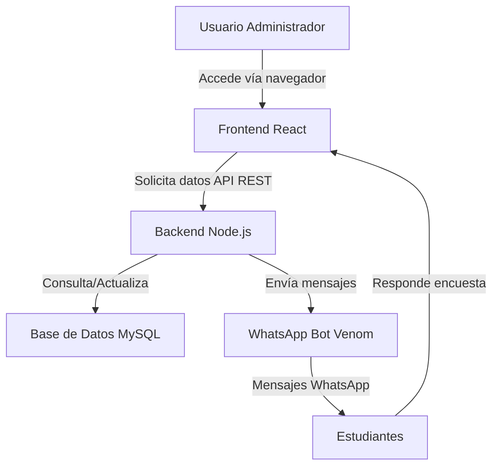

### 2.2 Vista Lógica
Arquitectura basada en componentes React para el frontend y servicios REST para el backend.

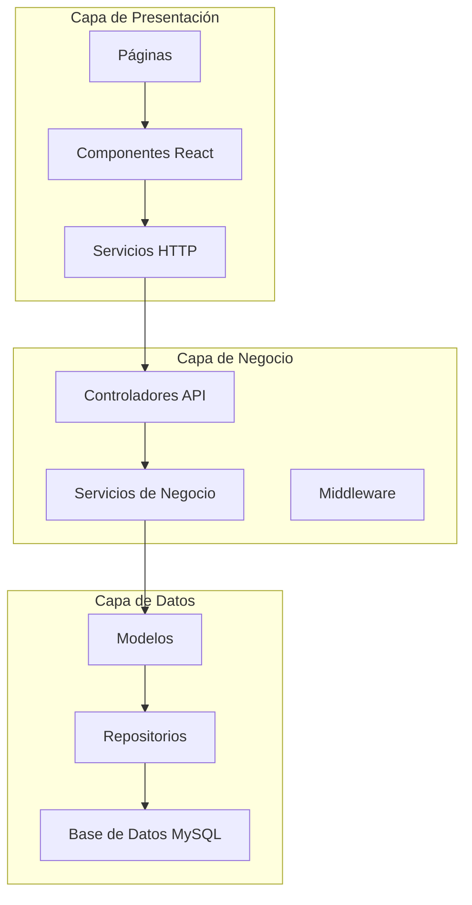

### 2.3 Vista del Proceso
Flujo asíncrono de comunicación entre componentes mediante API REST.

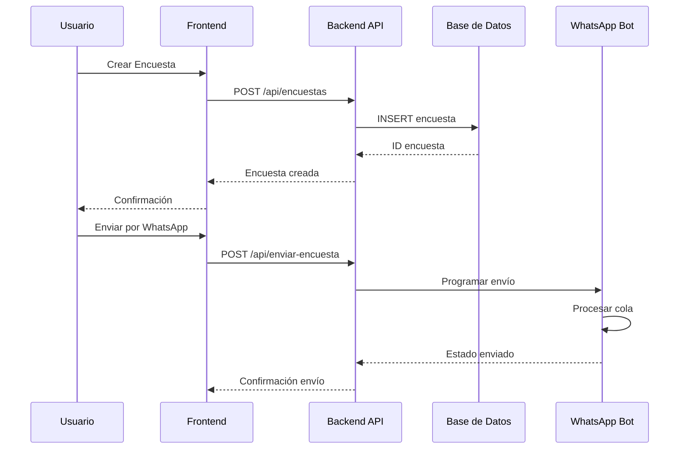

### 2.4 Vista del Desarrollo
Desarrollo modular con separación clara de responsabilidades.

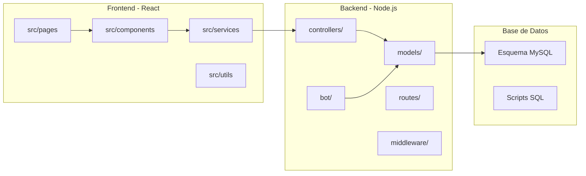

### 2.5 Vista Física
Despliegue en contenedores Docker para garantizar portabilidad.

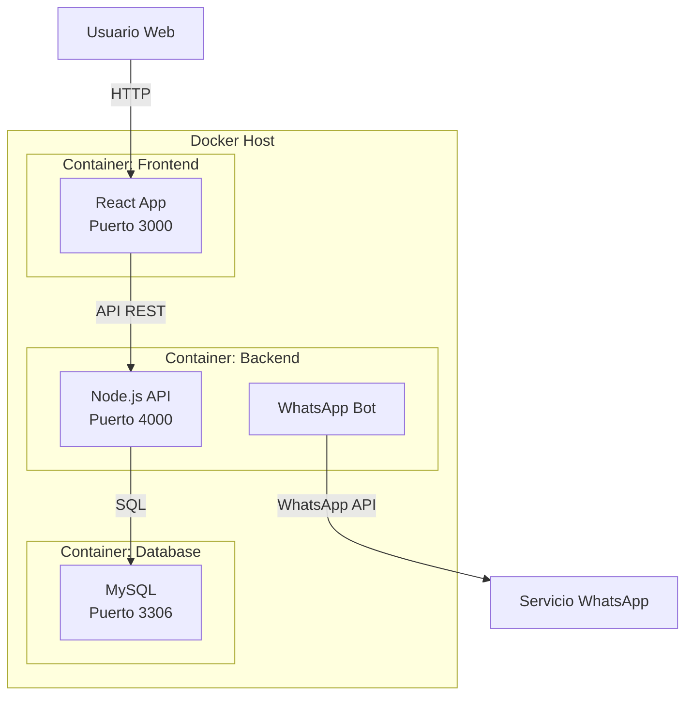

## 3. Objetivos y limitaciones arquitectónicas

### 3.1 Disponibilidad
- Tiempo de actividad objetivo: 99.9%
- Respaldo automático de datos diario
- Manejo robusto de errores
- Logs de sistema completos

### 3.2 Seguridad
- Autenticación mediante JWT
- Encriptación de contraseñas con bcrypt
- Validación de datos de entrada
- Control de acceso basado en roles
- Protección contra SQL Injection
- CORS configurado apropiadamente

### 3.3 Adaptabilidad
- Diseño modular y desacoplado
- Interfaces bien definidas
- Configuración externalizada
- API RESTful versionada
- Código documentado

### 3.4 Rendimiento
- Tiempo de respuesta objetivo: < 2 segundos
- Optimización de consultas SQL
- Paginación de resultados
- Caché de datos frecuentes
- Compresión de respuestas HTTP

## 4. Análisis de Requerimientos

### 4.1 Requerimientos funcionales
| ID | Requerimiento | Descripción |
|----|---------------|-------------|
| RF01 | Gestión de Encuestas | CRUD completo de encuestas con preguntas dinámicas |
| RF02 | Gestión de Estudiantes | Registro y administración de estudiantes |
| RF03 | Gestión de Cursos | Administrar cursos, docentes y secciones |
| RF04 | Envío WhatsApp | Automatización de envío de encuestas vía WhatsApp |
| RF05 | Dashboard | Visualización de estadísticas y reportes |
| RF06 | Respuestas | Registro y consulta de respuestas de estudiantes |

### 4.2 Requerimientos no funcionales
| ID | Requerimiento | Descripción |
|----|---------------|-------------|
| RNF01 | Seguridad | Protección de datos sensibles y autenticación |
| RNF02 | Escalabilidad | Soporte para crecimiento de usuarios |
| RNF03 | Usabilidad | Interfaz intuitiva y responsive |
| RNF04 | Rendimiento | Tiempos de respuesta óptimos |
| RNF05 | Mantenibilidad | Código limpio y documentado |
| RNF06 | Portabilidad | Despliegue mediante contenedores |

## 5. Vistas de Caso de Uso

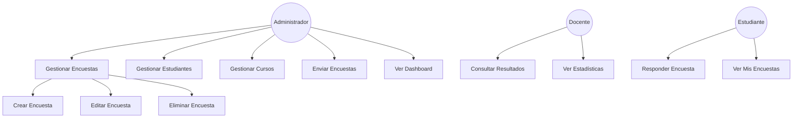

## 6. Vista Lógica

### 6.1 Diagrama Contextual

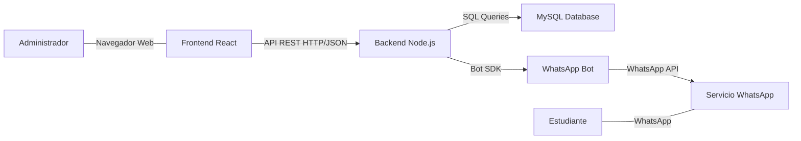

### 6.2 Diagrama de Paquetes

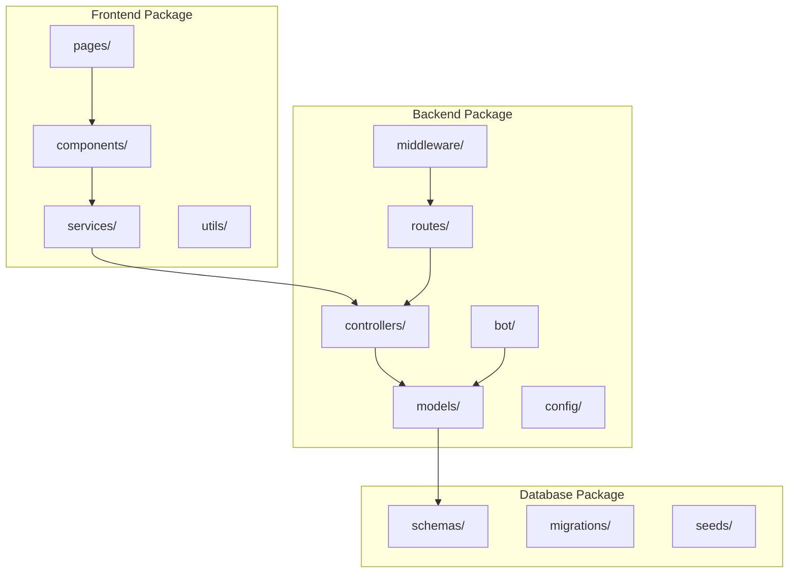

## 7. Vista de Procesos

### 7.1 Diagrama de Proceso Actual (Antes del Sistema)

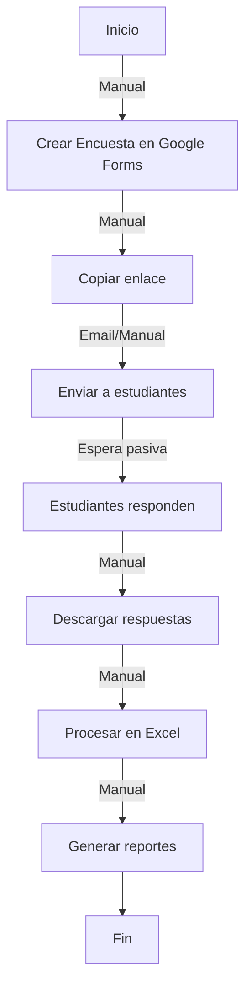

### 7.2 Diagrama de Proceso Propuesto (Con el Sistema)

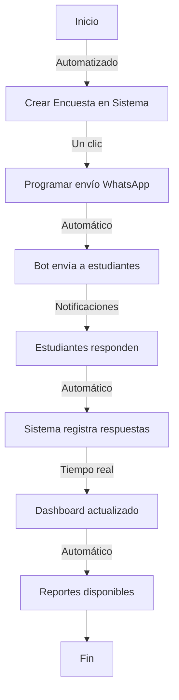

## 8. Vista de Despliegue

### 8.1 Diagrama de Contenedor

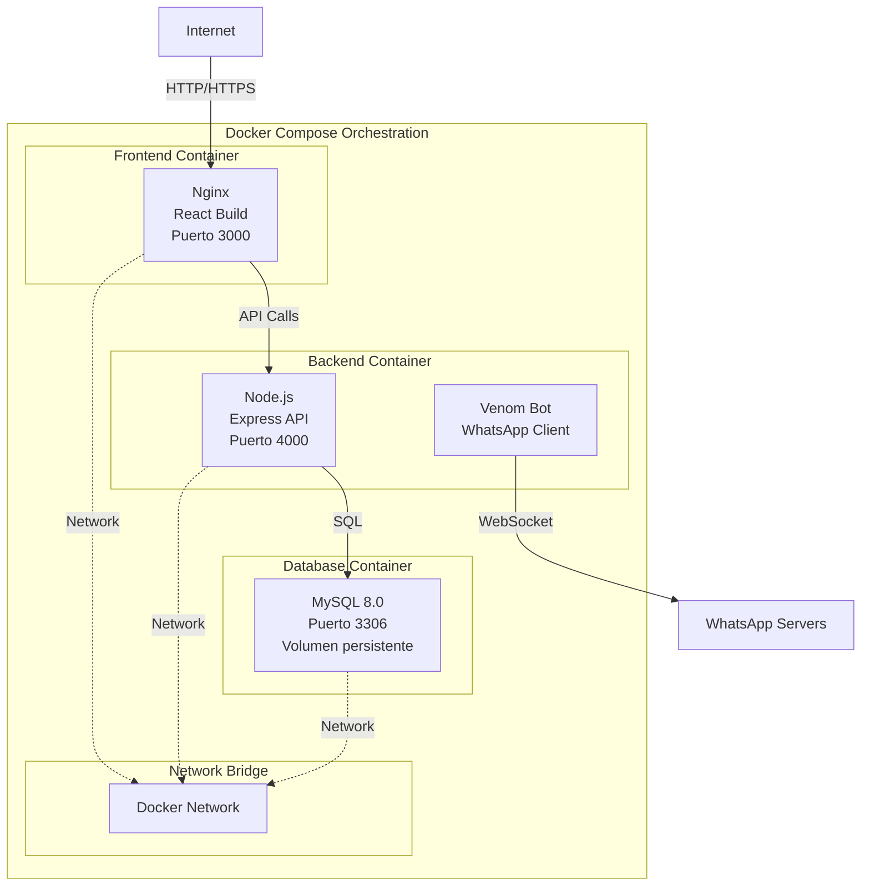

## 9. Vista de Implementación

### 9.1 Diagrama de Componentes

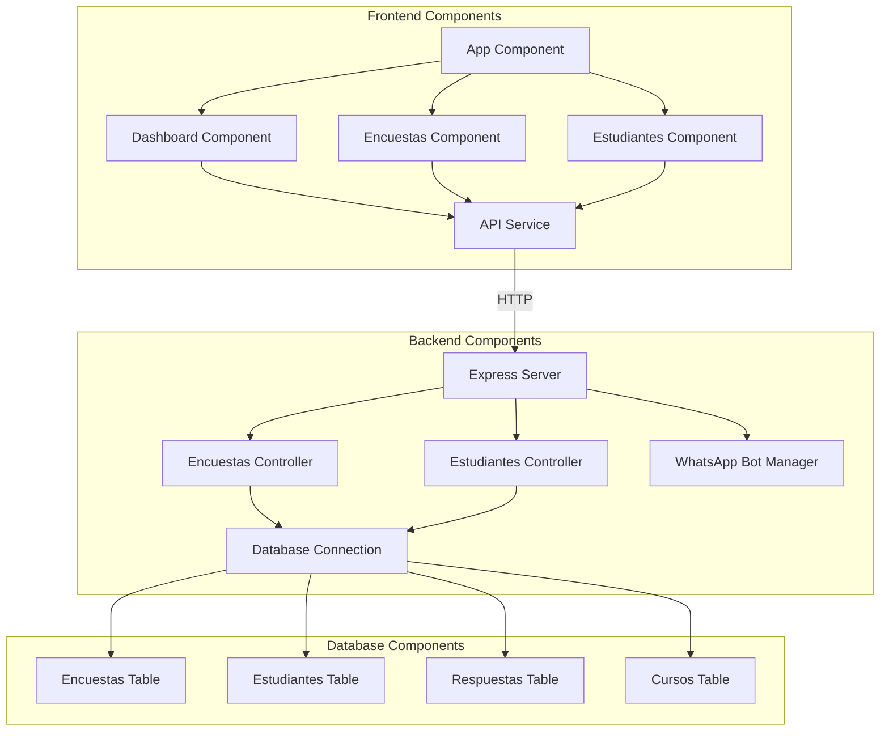

## 10. Vista de Datos

### 10.1 Diagrama Entidad Relación

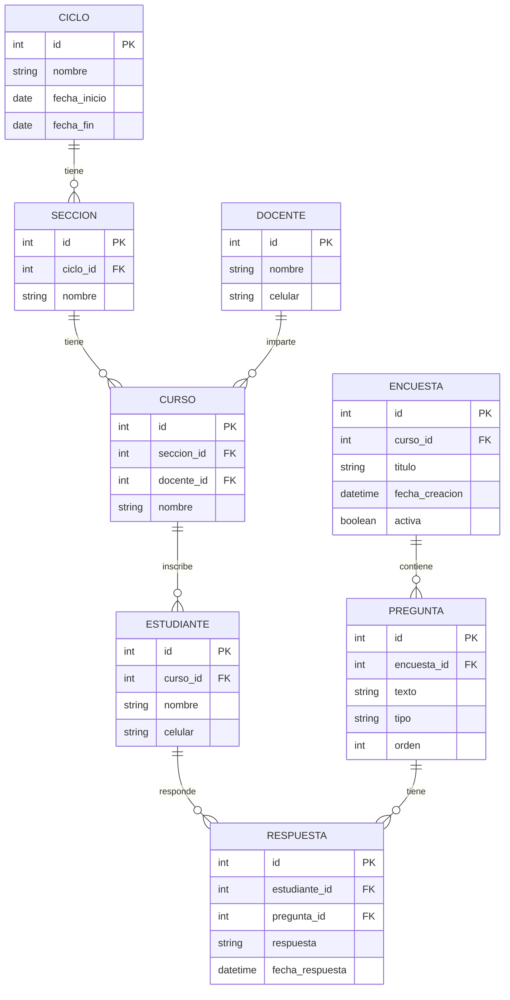

## 11. Calidad

### 11.1 Escenario de Seguridad

**Atributo de Calidad:** Seguridad  
**Estímulo:** Usuario no autenticado intenta acceder a endpoints protegidos  
**Respuesta:** El sistema deniega el acceso y registra el intento

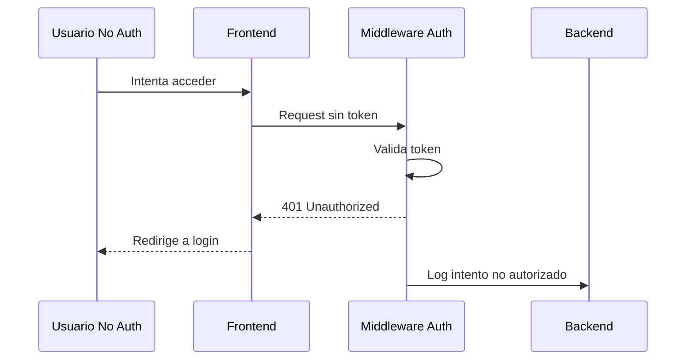

### 11.2 Escenario de Usabilidad

**Atributo de Calidad:** Usabilidad  
**Estímulo:** Usuario crea nueva encuesta  
**Respuesta:** Proceso intuitivo con feedback en cada paso

**Características:**
- Interfaz responsive
- Validación en tiempo real
- Mensajes claros de error/éxito
- Diseño consistente
- Navegación intuitiva

### 11.3 Escenario de Adaptabilidad

**Atributo de Calidad:** Adaptabilidad  
**Estímulo:** Se requiere agregar nuevo tipo de pregunta  
**Respuesta:** Módulo de preguntas permite extensión sin modificar código existente

**Estrategias:**
- Arquitectura modular
- Componentes reutilizables
- Configuración externalizada
- API versionada
- Interfaces bien definidas

### 11.4 Escenario de Disponibilidad

**Atributo de Calidad:** Disponibilidad  
**Estímulo:** Fallo en conexión a base de datos  
**Respuesta:** Sistema maneja error gracefully y notifica administrador

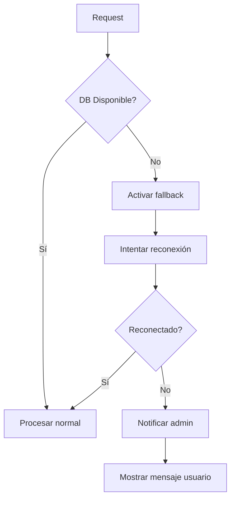

### 11.5 Escenario de Rendimiento

**Atributo de Calidad:** Rendimiento  
**Estímulo:** 100 estudiantes responden encuesta simultáneamente  
**Respuesta:** Sistema procesa todas las respuestas en < 3 segundos

**Estrategias de optimización:**
- Índices en base de datos
- Paginación de resultados
- Compresión de respuestas
- Caché de consultas frecuentes
- Procesamiento asíncrono

---

**Documento elaborado por:** Equipo de Desarrollo ESPG  
**Fecha:** Noviembre 2025  
**Versión:** 1.0