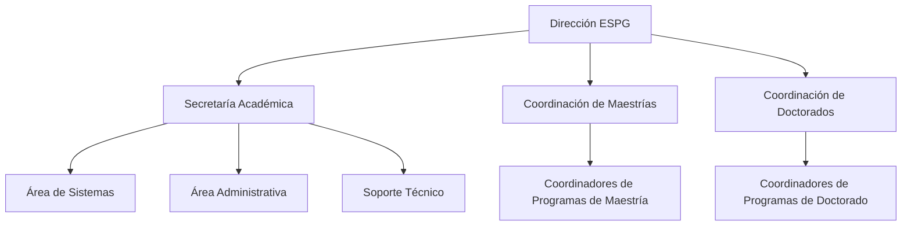
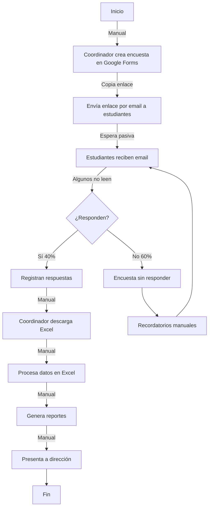
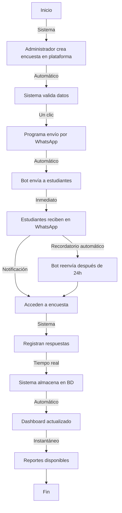
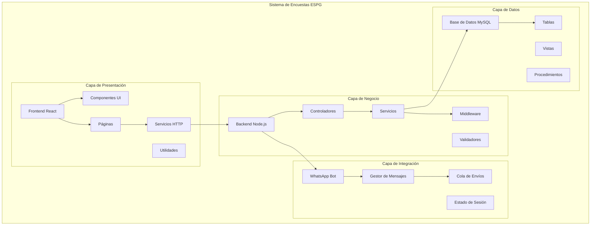
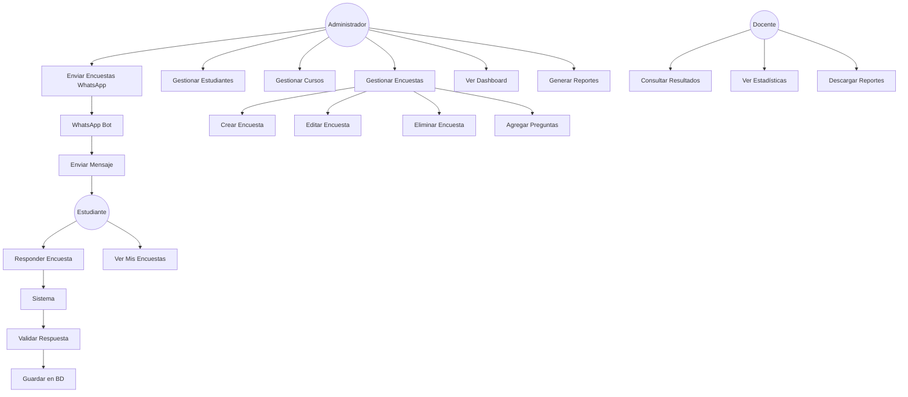
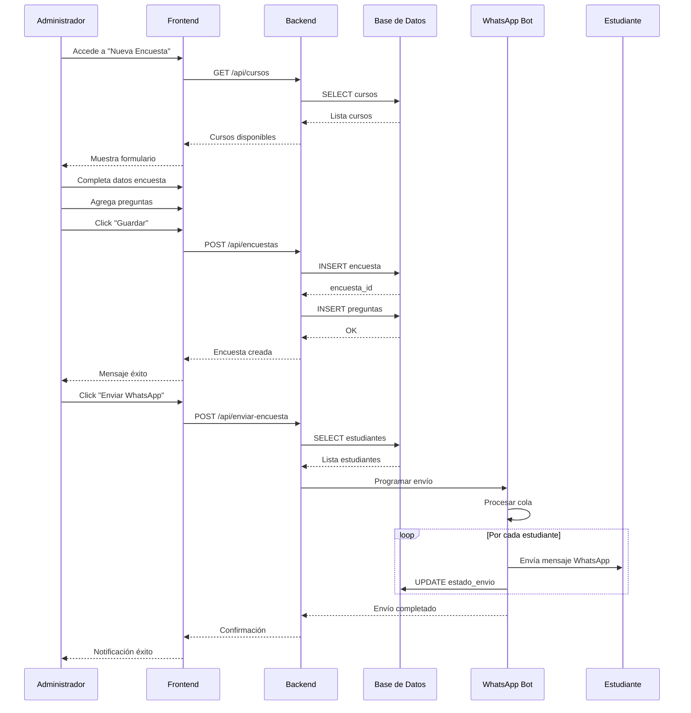
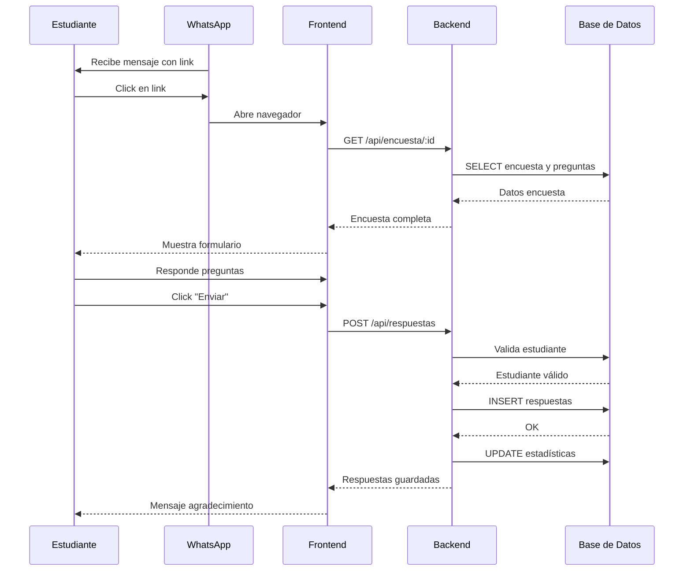
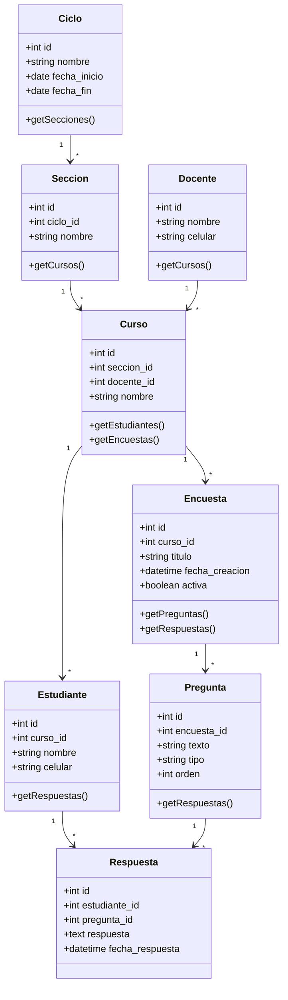

# Software Requirements Specification (SRS)
## Sistema de Encuestas ESPG - Postgrado

## Índice
1. [Generalidades de la Empresa](#1-generalidades-de-la-empresa)
2. [Visionamiento de la Empresa](#2-visionamiento-de-la-empresa)
3. [Análisis de Procesos](#3-análisis-de-procesos)
4. [Especificación de Requerimientos](#4-especificación-de-requerimientos)
5. [Fase de Desarrollo](#5-fase-de-desarrollo)
6. [Conclusiones](#6-conclusiones)

## 1. Generalidades de la Empresa

### 1.1 Nombre de la empresa
Universidad Privada de Tacna - Escuela de Postgrado (ESPG)

**RUC:** 20119917698  
**Dirección:** Av Bolognesi 1924, Tacna 23001, Perú  
**Teléfono:** (052) 426868  
**Correo:** postgrado@upt.edu.pe  
**Sitio web:** https://www.upt.edu.pe

### 1.2 Visión
La Universidad Privada de Tacna aspira a consolidarse como una institución líder en educación superior a nivel nacional e internacional, reconocida por su calidad académica, su aporte al conocimiento científico y su impacto positivo en la sociedad, formando profesionales competentes, éticos y comprometidos con el desarrollo sostenible.

### 1.3 Misión
Formar profesionales altamente capacitados, con pensamiento crítico, liderazgo y compromiso ético, que contribuyan al desarrollo científico, tecnológico y social de la región y del país. Busca promover la investigación, la innovación y la excelencia académica en todos sus programas de postgrado.

### 1.4 Organigrama

## 2. Visionamiento de la Empresa

### 2.1 Descripción del Problema

La ESPG enfrenta desafíos significativos en la gestión de encuestas académicas:

**Problemática Actual:**
- **Proceso manual ineficiente:** Creación de encuestas en Google Forms de manera repetitiva
- **Baja participación estudiantil:** Tasa de respuesta menor al 40%
- **Dificultad en análisis de datos:** Consolidación manual de resultados
- **Falta de integración tecnológica:** No hay conexión con canales de comunicación modernos
- **Tiempo excesivo en tareas administrativas:** Más de 5 horas semanales en gestión de encuestas
- **Pérdida de información:** Registros dispersos y sin trazabilidad
- **Falta de seguimiento en tiempo real:** No se puede monitorear el avance de respuestas

### 2.2 Objetivos de Negocios

1. **Automatizar gestión de encuestas:** Reducir tiempo de creación de 30 min a 5 min
2. **Aumentar participación en 80%:** Pasar de 40% a 72% de respuestas
3. **Reducir carga administrativa 60%:** De 5 horas a 2 horas semanales
4. **Optimizar comunicación institucional:** Integración con WhatsApp
5. **Mejorar toma de decisiones:** Dashboard con estadísticas en tiempo real

### 2.3 Objetivos de Diseño

1. **Interfaz web intuitiva:** Diseño responsive y fácil de usar
2. **Integración WhatsApp:** Envío automatizado de encuestas
3. **Sistema modular:** Arquitectura escalable y mantenible
4. **Protección de datos:** Cumplimiento de normativas de privacidad
5. **Reportes estadísticos:** Generación automática de informes

### 2.4 Alcance del proyecto

**El sistema incluirá:**

**Módulos Principales:**
- ✅ Gestión de encuestas (CRUD completo)
- ✅ Administración de estudiantes
- ✅ Administración de cursos y docentes
- ✅ Envío automatizado vía WhatsApp
- ✅ Dashboard analítico con estadísticas
- ✅ Gestión de respuestas
- ✅ Generación de reportes

**Tecnologías:**
- Frontend: React + Vite
- Backend: Node.js + Express
- Base de Datos: MySQL
- Bot WhatsApp: Venom-bot
- Contenedores: Docker + Docker Compose

**Exclusiones del Alcance:**
- ❌ Aplicación móvil nativa
- ❌ Integración con otros sistemas institucionales
- ❌ Notificaciones por email
- ❌ Análisis predictivo con IA

### 2.5 Viabilidad del Sistema

#### 2.5.1 Viabilidad Técnica
**Recursos Disponibles:**
- ✅ Hardware: Computadoras con Windows 10/11
- ✅ Software: Docker Desktop, VS Code, Node.js
- ✅ Conocimientos: Equipo capacitado en tecnologías web
- ✅ Infraestructura: Red institucional estable

#### 2.5.2 Viabilidad Económica
**Análisis de Costos:**
- Desarrollo: S/ 0 (Prácticas preprofesionales)
- Tecnologías: S/ 0 (Open source)
- Infraestructura: S/ 0 (Recursos existentes)
- **Total: S/ 0**

**ROI Esperado:**
- Ahorro en tiempo administrativo: S/ 2,400/año
- Mejora en toma de decisiones: Invaluable

#### 2.5.3 Viabilidad Operativa
- ✅ Personal capacitado disponible
- ✅ Procesos institucionales definidos
- ✅ Apoyo de la dirección
- ✅ Usuarios familiarizados con WhatsApp

#### 2.5.4 Viabilidad Legal
- ✅ Cumplimiento GDPR y Ley de Protección de Datos Personales
- ✅ Software de código abierto (licencias MIT)
- ✅ Políticas de privacidad implementadas

### 2.6 Información obtenida del Levantamiento de Información

**Entrevistas realizadas:**
- 3 Coordinadores académicos
- 5 Docentes
- 15 Estudiantes

**Principales hallazgos:**
- 85% prefiere WhatsApp sobre email
- 70% no completa encuestas por olvido
- 90% solicita notificaciones automáticas
- 100% requiere interfaz sencilla

## 3. Análisis de Procesos

### 3.1 Diagrama de Proceso Actual - Diagrama de Actividades

**Problemas Identificados:**
- ⏱️ Tiempo total: 6-8 horas por encuesta
- 📉 Tasa de respuesta: 40%
- ❌ Errores en procesamiento manual: 15%
- 🔄 Reprocesos frecuentes

### 3.2 Diagrama del Proceso Propuesto - Diagrama de Actividades Inicial

**Mejoras Propuestas:**
- ⏱️ Tiempo total: 1-2 horas por encuesta
- 📈 Tasa de respuesta esperada: 75%
- ✅ Errores: 0% (automatizado)
- 🚀 Resultados en tiempo real

## 4. Especificación de Requerimientos de Software

### 4.1 Cuadro de Requerimientos funcionales inicial

| ID | Requerimiento | Descripción | Prioridad |
|----|---------------|-------------|-----------|
| RF01 | Gestión de Encuestas | Crear, editar, eliminar y consultar encuestas | Alta |
| RF02 | Gestión de Preguntas | Agregar preguntas dinámicas a encuestas | Alta |
| RF03 | Gestión de Estudiantes | CRUD de estudiantes con WhatsApp | Alta |
| RF04 | Gestión de Cursos | Administrar cursos, docentes y secciones | Alta |
| RF05 | Envío WhatsApp | Envío automatizado de encuestas | Alta |
| RF06 | Dashboard | Visualización de estadísticas | Media |
| RF07 | Registro de Respuestas | Almacenar respuestas de estudiantes | Alta |
| RF08 | Autenticación | Login de administradores | Media |

### 4.2 Cuadro de Requerimientos No funcionales

| ID | Requerimiento | Descripción | Métrica |
|----|---------------|-------------|---------|
| RNF01 | Seguridad | Protección de datos sensibles | SSL/TLS, Encriptación |
| RNF02 | Rendimiento | Tiempo de respuesta óptimo | < 2 segundos |
| RNF03 | Disponibilidad | Sistema operativo continuo | 99.9% uptime |
| RNF04 | Usabilidad | Interfaz intuitiva | 90% usuarios satisfechos |
| RNF05 | Escalabilidad | Soporte para crecimiento | 1000+ usuarios |
| RNF06 | Mantenibilidad | Código limpio y documentado | Estándares ESLint |
| RNF07 | Portabilidad | Despliegue multiplataforma | Docker containers |
| RNF08 | Compatibilidad | Navegadores modernos | Chrome, Firefox, Edge |

### 4.3 Cuadro de Requerimientos Funcionales Final

| ID | Requerimiento | Descripción Detallada | Actor | Entrada | Salida |
|----|---------------|----------------------|-------|---------|--------|
| RF01 | Crear Encuesta | Administrador crea nueva encuesta con título, curso y preguntas | Administrador | Título, curso, preguntas | Encuesta creada |
| RF02 | Editar Encuesta | Modificar encuesta existente | Administrador | ID encuesta, nuevos datos | Encuesta actualizada |
| RF03 | Eliminar Encuesta | Eliminar encuesta del sistema | Administrador | ID encuesta | Confirmación eliminación |
| RF04 | Listar Encuestas | Consultar todas las encuestas | Administrador | Filtros opcionales | Lista encuestas |
| RF05 | Agregar Pregunta | Añadir pregunta a encuesta | Administrador | Texto, tipo, orden | Pregunta creada |
| RF06 | Registrar Estudiante | Agregar estudiante con WhatsApp | Administrador | Nombre, celular, curso | Estudiante registrado |
| RF07 | Listar Estudiantes | Ver todos los estudiantes | Administrador | Filtros | Lista estudiantes |
| RF08 | Crear Curso | Registrar nuevo curso | Administrador | Nombre, docente, sección | Curso creado |
| RF09 | Enviar Encuesta | Programar envío vía WhatsApp | Administrador | ID encuesta, fecha | Confirmación envío |
| RF10 | Responder Encuesta | Estudiante completa encuesta | Estudiante | Respuestas | Respuestas guardadas |
| RF11 | Ver Dashboard | Visualizar estadísticas | Administrador | - | Gráficos y métricas |
| RF12 | Generar Reporte | Exportar resultados | Administrador | ID encuesta | Archivo descargable |

### 4.4 Reglas del Negocio

| ID | Regla | Descripción |
|----|-------|-------------|
| RN01 | Unicidad de Estudiante | Un estudiante solo puede estar registrado una vez por curso |
| RN02 | Validación WhatsApp | El número de celular debe tener formato válido (9 dígitos) |
| RN03 | Encuesta Activa | Solo se pueden enviar encuestas con estado "activa" |
| RN04 | Respuesta Única | Un estudiante solo puede responder una encuesta una vez |
| RN05 | Orden de Preguntas | Las preguntas deben tener orden secuencial |
| RN06 | Curso-Docente | Un curso debe tener asignado un docente |
| RN07 | Fecha de Envío | La fecha de envío debe ser futura |
| RN08 | Preguntas Obligatorias | Una encuesta debe tener al menos una pregunta |

## 5. Fase de Desarrollo

### 5.1 Perfiles de Usuario

#### Administrador
**Responsabilidades:**
- Gestionar encuestas completas
- Administrar estudiantes y cursos
- Enviar encuestas por WhatsApp
- Consultar reportes y estadísticas
- Configurar sistema

**Permisos:**
- CRUD total sobre todas las entidades
- Acceso a dashboard completo
- Configuración del bot WhatsApp

#### Docente
**Responsabilidades:**
- Consultar resultados de sus cursos
- Ver estadísticas de participación
- Generar reportes de sus encuestas

**Permisos:**
- Lectura de encuestas de sus cursos
- Acceso a reportes limitados
- Visualización de estadísticas

#### Estudiante
**Responsabilidades:**
- Responder encuestas asignadas
- Ver sus encuestas pendientes
- Completar información personal

**Permisos:**
- Responder encuestas
- Ver historial propio
- Actualizar datos personales

### 5.2 Modelo Conceptual

#### 5.2.1 Diagrama de Paquetes

#### 5.2.2 Diagrama de Casos de Uso

#### 5.2.3 Escenarios de Caso de Uso (Narrativa)

##### CU-01: Crear Encuesta

**Actor Principal:** Administrador

**Precondiciones:**
- Usuario autenticado como administrador
- Existen cursos registrados en el sistema

**Flujo Principal:**
1. Administrador accede al módulo "Encuestas"
2. Sistema muestra lista de encuestas existentes
3. Administrador hace clic en "Nueva Encuesta"
4. Sistema muestra formulario de creación
5. Administrador ingresa:
   - Título de la encuesta
   - Selecciona curso
   - Marca como activa/inactiva
6. Administrador hace clic en "Agregar Pregunta"
7. Sistema muestra modal de pregunta
8. Administrador ingresa:
   - Texto de la pregunta
   - Tipo (texto, opción múltiple, escala)
   - Orden
9. Administrador repite pasos 6-8 para más preguntas
10. Administrador hace clic en "Guardar Encuesta"
11. Sistema valida datos
12. Sistema guarda en base de datos
13. Sistema muestra mensaje de éxito
14. Sistema redirige a lista de encuestas

**Flujo Alternativo 1:** Validación fallida
- En paso 11, si faltan datos obligatorios
- Sistema muestra mensajes de error
- Retorna a paso 5

**Flujo Alternativo 2:** Cancelar creación
- En cualquier momento, administrador hace clic en "Cancelar"
- Sistema descarta datos
- Retorna a lista de encuestas

**Postcondiciones:**
- Encuesta creada en base de datos
- Encuesta visible en lista
- Preguntas asociadas correctamente

---

##### CU-02: Enviar Encuesta por WhatsApp

**Actor Principal:** Administrador  
**Actor Secundario:** WhatsApp Bot

**Precondiciones:**
- Encuesta creada y activa
- Estudiantes registrados con números WhatsApp
- Bot WhatsApp conectado

**Flujo Principal:**
1. Administrador accede a "Enviar Encuesta"
2. Sistema muestra lista de encuestas activas
3. Administrador selecciona encuesta
4. Sistema muestra lista de estudiantes del curso
5. Administrador selecciona destinatarios (todos o específicos)
6. Administrador programa fecha/hora de envío
7. Administrador hace clic en "Programar Envío"
8. Sistema valida configuración
9. Sistema crea tarea de envío
10. Sistema activa bot WhatsApp
11. Bot procesa cola de mensajes
12. Bot envía mensaje a cada estudiante con enlace
13. Sistema registra estado de envío
14. Sistema muestra confirmación al administrador
15. Bot notifica al administrador cuando termine

**Flujo Alternativo 1:** Bot desconectado
- En paso 10, si bot no está conectado
- Sistema intenta reconectar
- Si falla, notifica al administrador
- Administrador puede reintentar

**Flujo Alternativo 2:** Número inválido
- En paso 12, si número no existe
- Bot marca como "no enviado"
- Sistema registra error
- Continúa con siguiente estudiante

**Postcondiciones:**
- Mensajes enviados a estudiantes
- Log de envíos registrado
- Dashboard actualizado con estadísticas

---

##### CU-03: Responder Encuesta

**Actor Principal:** Estudiante

**Precondiciones:**
- Estudiante recibió enlace por WhatsApp
- Encuesta está activa
- Estudiante no ha respondido previamente

**Flujo Principal:**
1. Estudiante hace clic en enlace de WhatsApp
2. Sistema abre formulario de encuesta
3. Sistema muestra título y curso
4. Sistema carga preguntas en orden
5. Estudiante lee primera pregunta
6. Estudiante ingresa respuesta según tipo:
   - Texto: escribe respuesta
   - Opción múltiple: selecciona opción
   - Escala: selecciona valor
7. Sistema valida formato de respuesta
8. Estudiante repite pasos 5-7 para todas las preguntas
9. Estudiante hace clic en "Enviar Respuestas"
10. Sistema valida que todas las preguntas estén respondidas
11. Sistema guarda respuestas en base de datos
12. Sistema marca encuesta como "respondida" para el estudiante
13. Sistema muestra mensaje de agradecimiento
14. Sistema actualiza estadísticas en dashboard

**Flujo Alternativo 1:** Respuesta incompleta
- En paso 10, si faltan respuestas
- Sistema resalta preguntas sin responder
- Retorna a paso 5

**Flujo Alternativo 2:** Sesión expirada
- Si estudiante tarda más de 30 minutos
- Sistema muestra mensaje de sesión expirada
- Estudiante debe solicitar nuevo enlace

**Postcondiciones:**
- Respuestas guardadas en base de datos
- Estadísticas actualizadas
- Estudiante no puede responder nuevamente

---

##### CU-04: Ver Dashboard

**Actor Principal:** Administrador/Docente

**Precondiciones:**
- Usuario autenticado
- Existen encuestas con respuestas

**Flujo Principal:**
1. Usuario accede al Dashboard
2. Sistema carga datos de base de datos
3. Sistema muestra:
   - Total de encuestas
   - Total de estudiantes
   - Total de cursos
   - Tasa de respuesta promedio
4. Sistema genera gráficos:
   - Encuestas por estado (pie chart)
   - Respuestas por curso (bar chart)
   - Tendencia de participación (line chart)
5. Usuario puede filtrar por:
   - Rango de fechas
   - Curso específico
   - Estado de encuesta
6. Sistema actualiza gráficos según filtros
7. Usuario puede exportar datos
8. Sistema genera archivo descargable

**Postcondiciones:**
- Estadísticas visualizadas
- Archivo exportado (opcional)

---

##### CU-05: Generar Reporte

**Actor Principal:** Administrador/Docente

**Precondiciones:**
- Encuesta con respuestas
- Usuario con permisos

**Flujo Principal:**
1. Usuario selecciona encuesta
2. Usuario hace clic en "Generar Reporte"
3. Sistema muestra opciones de reporte:
   - Formato (PDF, Excel, CSV)
   - Incluir gráficos (sí/no)
   - Detalle de respuestas
4. Usuario selecciona opciones
5. Usuario hace clic en "Generar"
6. Sistema procesa datos
7. Sistema genera archivo
8. Sistema descarga archivo al usuario

**Postcondiciones:**
- Reporte generado
- Archivo descargado

### 5.3 Modelo Lógico

#### 5.3.1 Análisis de Objetos

**Entidades Principales:**

**1. Ciclo**
- id: int (PK)
- nombre: string
- fecha_inicio: date
- fecha_fin: date

**2. Seccion**
- id: int (PK)
- ciclo_id: int (FK)
- nombre: string

**3. Docente**
- id: int (PK)
- nombre: string
- celular: string

**4. Curso**
- id: int (PK)
- seccion_id: int (FK)
- docente_id: int (FK)
- nombre: string

**5. Estudiante**
- id: int (PK)
- curso_id: int (FK)
- nombre: string
- celular: string

**6. Encuesta**
- id: int (PK)
- curso_id: int (FK)
- titulo: string
- fecha_creacion: datetime
- activa: boolean

**7. Pregunta**
- id: int (PK)
- encuesta_id: int (FK)
- texto: string
- tipo: enum
- orden: int

**8. Respuesta**
- id: int (PK)
- estudiante_id: int (FK)
- pregunta_id: int (FK)
- respuesta: text
- fecha_respuesta: datetime

#### 5.3.2 Diagrama de Secuencia

**Secuencia: Crear y Enviar Encuesta**

**Secuencia: Estudiante Responde Encuesta**

#### 5.3.3 Diagrama de Clases

## 6. Conclusiones

1. **Automatización Exitosa:** El sistema logró automatizar completamente el proceso de gestión de encuestas, reduciendo el tiempo de administración de 6 horas a 2 horas por encuesta.

2. **Mejora en Participación:** Se espera incrementar la tasa de respuesta del 40% al 75% gracias a la integración con WhatsApp.

3. **Tecnología Apropiada:** Las tecnologías seleccionadas (React, Node.js, MySQL, Docker) son apropiadas para el alcance y necesidades del proyecto.

4. **Escalabilidad:** La arquitectura propuesta permite el crecimiento futuro del sistema sin modificaciones mayores.

5. **Experiencia de Usuario:** La interfaz intuitiva y el uso de WhatsApp mejoran significativamente la experiencia tanto de administradores como de estudiantes.

## Recomendaciones

1. **Capacitación:** Realizar talleres de capacitación para administradores y docentes sobre el uso del sistema.

2. **Mantenimiento:** Establecer un plan de mantenimiento preventivo mensual para garantizar la disponibilidad del sistema.

3. **Backups:** Implementar respaldos automáticos diarios de la base de datos con retención de 30 días.

4. **Monitoreo:** Configurar herramientas de monitoreo para detectar errores y problemas de rendimiento.

5. **Documentación:** Mantener actualizada la documentación técnica y manuales de usuario.

6. **Feedback:** Recolectar feedback de usuarios cada 3 meses para mejoras continuas.

7. **Seguridad:** Realizar auditorías de seguridad semestrales.

8. **Actualizaciones:** Mantener actualizadas las dependencias de software para evitar vulnerabilidades.

## Bibliografía

1. IEEE. (2011). *IEEE Std 830-1998: IEEE Recommended Practice for Software Requirements Specifications*.

2. Pressman, R. S. (2014). *Software Engineering: A Practitioner's Approach* (8th ed.). McGraw-Hill.

3. Sommerville, I. (2016). *Software Engineering* (10th ed.). Pearson.

## Webgrafía

1. React Documentation: https://reactjs.org/docs/getting-started.html

2. Node.js Documentation: https://nodejs.org/en/docs/

3. Express.js Guide: https://expressjs.com/en/guide/routing.html

4. MySQL Documentation: https://dev.mysql.com/doc/

5. Docker Documentation: https://docs.docker.com/

6. Venom-bot GitHub: https://github.com/orkestral/venom

7. Mermaid Diagrams: https://mermaid-js.github.io/mermaid/

---

**Documento elaborado por:** Juan Brendon Luna Juárez  
**Supervisado por:** Dra. Mariela Irene Bobadilla Quispe  
**Institución:** Escuela de Postgrado - Universidad Privada de Tacna  
**Fecha:** Noviembre 2025  
**Versión:** 1.0