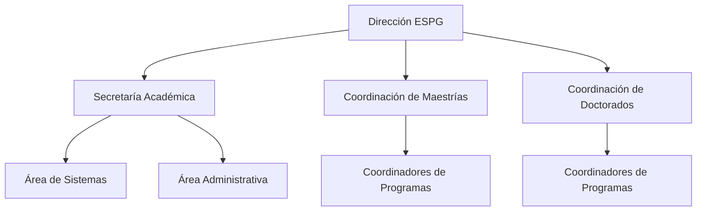
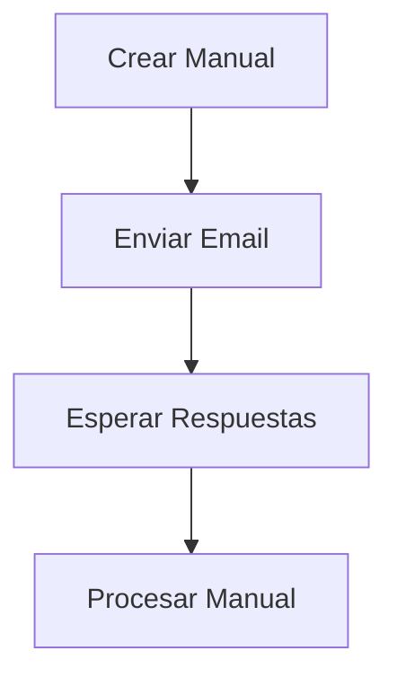
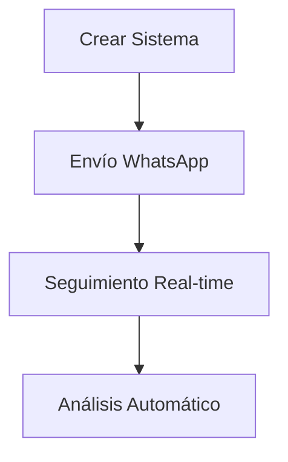
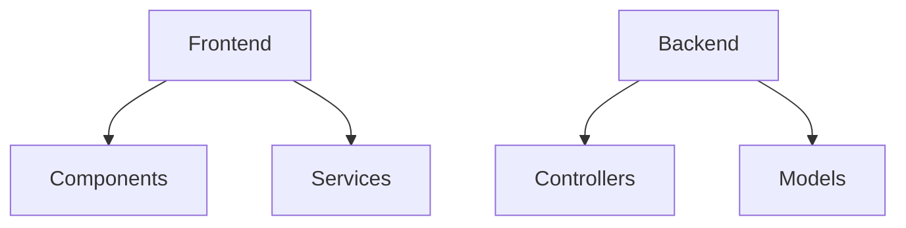
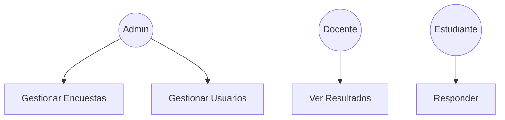

# Software Requirements Specification (SRS)
## Sistema de Encuestas ESPG - Postgrado

## Índice
1. [Generalidades de la Empresa](#1-generalidades-de-la-empresa)
2. [Visionamiento de la Empresa](#2-visionamiento-de-la-empresa)
3. [Análisis de Procesos](#3-análisis-de-procesos)
4. [Especificación de Requerimientos](#4-especificación-de-requerimientos)
5. [Fase de Desarrollo](#5-fase-de-desarrollo)
6. [Conclusiones](#6-conclusiones)

## 1. Generalidades de la Empresa

### 1.1 Nombre de la empresa
Universidad Privada de Tacna - Escuela de Postgrado (ESPG)

### 1.2 Visión
La Universidad Privada de Tacna aspira a consolidarse como una institución líder en educación superior a nivel nacional e internacional, reconocida por su calidad académica, su aporte al conocimiento científico y su impacto positivo en la sociedad.

### 1.3 Misión
Formar profesionales altamente capacitados, con pensamiento crítico, liderazgo y compromiso ético, que contribuyan al desarrollo científico, tecnológico y social de la región y del país.

### 1.4 Organigrama

## 2. Visionamiento de la Empresa

### 2.1 Descripción del Problema
La ESPG enfrenta desafíos en la gestión de encuestas académicas:
- Proceso manual ineficiente
- Baja participación estudiantil
- Dificultad en análisis de datos
- Falta de integración tecnológica
- Tiempo excesivo en tareas administrativas

### 2.2 Objetivos de Negocios
1. Automatizar gestión de encuestas
2. Aumentar participación en 80%
3. Reducir carga administrativa 60%
4. Optimizar comunicación institucional
5. Mejorar toma de decisiones

### 2.3 Objetivos de Diseño
1. Interfaz web intuitiva
2. Integración WhatsApp
3. Sistema modular
4. Protección de datos
5. Reportes estadísticos

### 2.4 Alcance del proyecto
El sistema incluirá:
- Gestión de encuestas
- Administración de usuarios
- Envío automatizado WhatsApp
- Dashboard analítico
- API REST
- Base de datos MySQL

### 2.5 Viabilidad del Sistema
- Técnica: Recursos disponibles
- Económica: Bajo costo implementación
- Operativa: Personal capacitado
- Legal: Cumplimiento normativas

## 3. Análisis de Procesos

### 3.1 Diagrama de Proceso Actual

### 3.2 Diagrama del Proceso Propuesto

## 4. Especificación de Requerimientos

### 4.1 Requerimientos funcionales inicial
| ID | Requerimiento | Descripción |
|----|---------------|-------------|
| RF01 | Gestión Encuestas | CRUD encuestas |
| RF02 | Gestión Usuarios | CRUD usuarios |
| RF03 | Envío WhatsApp | Automatización mensajes |
| RF04 | Dashboard | Reportes estadísticos |

### 4.2 Requerimientos No funcionales
| ID | Requerimiento | Descripción |
|----|---------------|-------------|
| RNF01 | Seguridad | Datos protegidos |
| RNF02 | Rendimiento | Respuesta <2s |
| RNF03 | Disponibilidad | 99.9% uptime |

## 5. Fase de Desarrollo

### 5.1 Perfiles de Usuario
- Administrador
- Docente
- Estudiante

### 5.2 Modelo Conceptual

#### 5.2.1 Diagrama de Paquetes

#### 5.2.2 Diagrama de Casos de Uso

## 6. Conclusiones
- Sistema optimizará procesos
- Aumentará participación
- Mejorará toma decisiones

## Recomendaciones
1. Capacitación usuarios
2. Mantenimiento periódico
3. Backup datos regular

## Bibliografía
- IEEE SRS Standards
- React Documentation
- Node.js Guides

## Webgrafía
- https://reactjs.org/
- https://nodejs.org/
- https://www.docker.com/